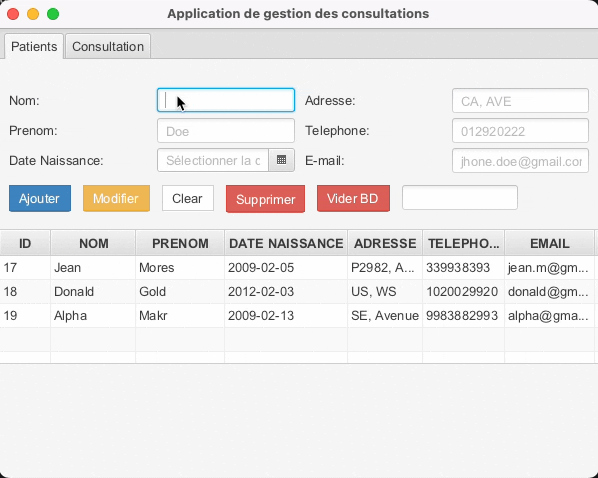
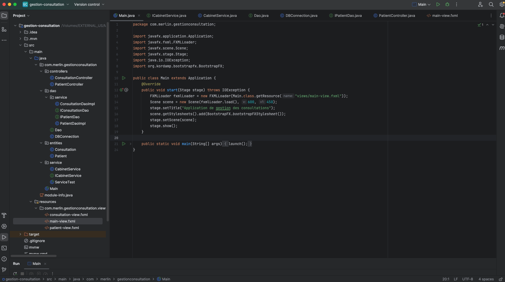
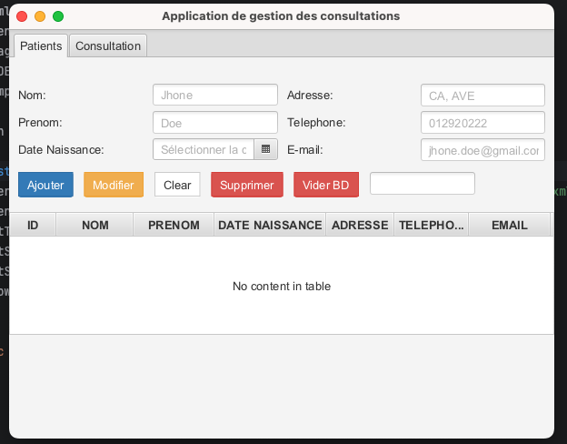
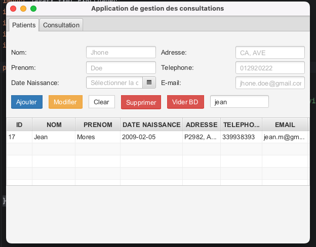
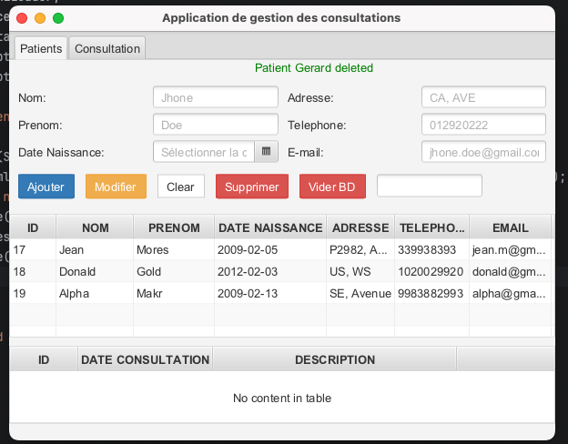
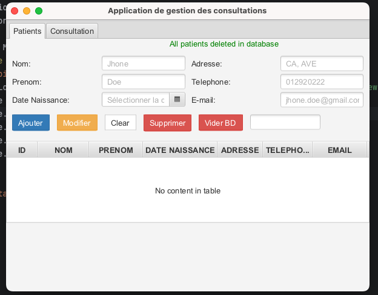
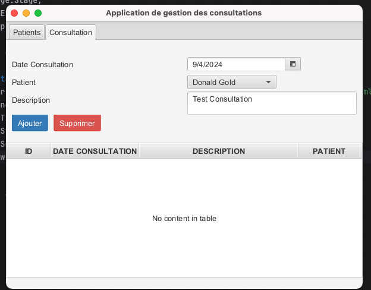
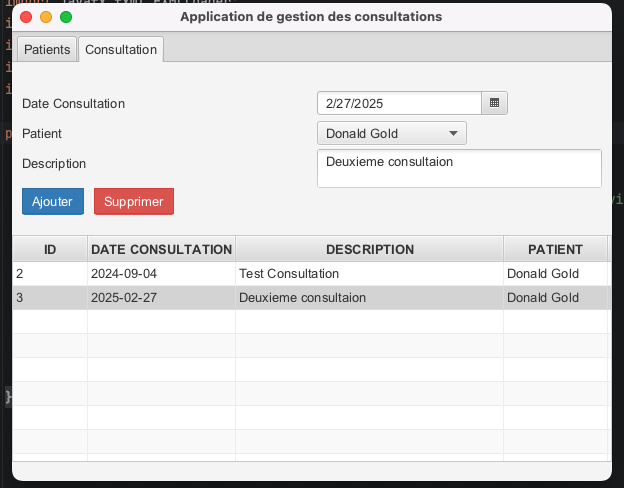
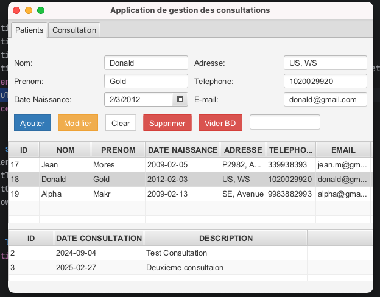

# Application de Gestion des Patients et des Consultation avec JavaFX et Bootstrap FX
- MVC
- Générécité
- JavaFX
- BootStrapFX
- JDBC
- MYSQL
- Interface
- Service
- Singleton
- SGBDR
######

## Structure du projet

## Accueil

## Ajouter le Patient `Alpha`

## Rechercher le patient `Jean`

## Modification Patient `Jhon Doe` a `Gerard Maole`

## Suppression Patient de `Gerard Maole`

## Vider la table Patients

## Consultations au Patient `Donald Gold`
### Remplir le formulaire

### Lisye des consultations

## En de selection, afficher aussi le patient et ses Consultations (s'il y'en a)

